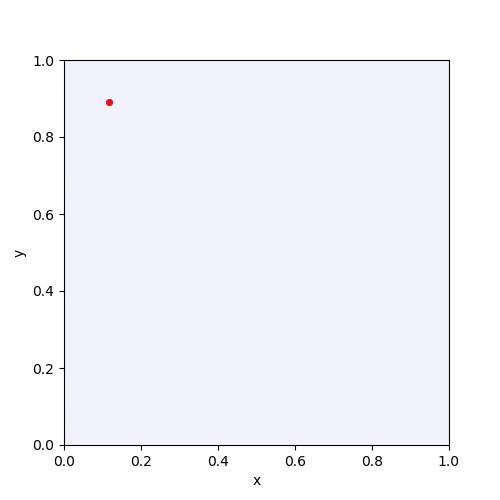

# d-FuzzStream

Python implementation of the fuzzy data stream clustering algorithm from the article [d-FuzzStream: A Dispersion-Based Fuzzy Data Stream Clustering](https://doi.org/10.1109/FUZZ-IEEE.2018.8491534).

## Content of the repository

* [main.pdf](report/main.pdf) — review of the article (russian)
* [d_fuzzstream](d_fuzzstream) — source code
* [make_gif.py](make_gif.py) — testing code (demo generator)

## Demonstration

Colored dots represent data stream examples from the dataset [Bench1_11k](https://github.com/vpozdnyakov/DS_Datasets/tree/master/Synthetic/Non-Stationary/Bench1_11k). Blue circles represent FMiCs, and their radiusis are calculated with respect to the Algorithm 1 from the article — the minimum distance to the nearest FMiC’s prototype if N=1 and the fuzzy dispersion otherwise.

